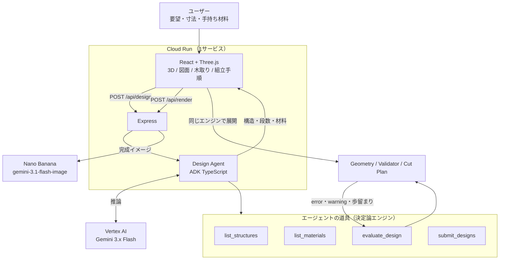

# DIY Design Compiler

作りたいものの寸法と手持ちの材料を、**現実に製作可能な部材・木取り・組立手順へコンパイルする**Webアプリ。

要件は [`diy-ai-requirements.md`](./diy-ai-requirements.md) を参照。
第5回 AI Agent Hackathon with Google Cloud への提出を想定している。

## 何が「エージェント」なのか

生成 AI に「棚の作り方」を聞くと文章と概算が返る。しかし DIY で本当に要るのは、
手持ちの 1820mm の 2×4 材から**どこを切れば足りるのか**であって、文章ではない。

このアプリのエージェントは、思いついた構造をそのまま返さない。
**実際に部材へ展開し、検証にかけ、通らなければ自分で直す。**

```
構造を提案
   ↓  evaluate_design（ツール）
Geometry Engine が部材寸法を導出
Validator が定尺・たわみ・転倒を検査
Cut Plan Engine が木取りと歩留まりを計算
   ↓
error / warning をエージェントが読む
   ↓
段数・材料・構造を変えて再評価  ── ループ ──┐
   ↓                                        │
収束したら submit_designs ←─────────────────┘
```

ループを回す材料は LLM の自己評価ではなく、決定論エンジンが出した実測値
（歩留まり、部材点数、定尺超過、段の有効高さ）である。
だから「もっともらしいが作れない設計」で止まらない。

検討の足跡は画面に出る。何を試して、どの検証で弾かれて、何を直したかが読める。

## 責務の分離

AI にすべてを任せない（要件定義書 §4.1）。

| 層 | 担当 | 実装 |
| --- | --- | --- |
| **設計意図** | 要望の理解、構造と材料の選択、検証結果への対応 | `server/agent/` (ADK + Gemini) |
| 幾何 | Structure + 寸法 → 部材・接続 | `src/core/structures/` |
| 検証 | 定尺・シートに収まるか、たわみ・転倒 | `src/core/validator.ts` |
| 木取り | 1D Cutting Stock（kerf 込み）・板材配置 | `src/core/cutplan.ts` |
| 組立 | 手順と金物の集計 | `src/core/assembly.ts` |

エージェントが決められるのは「どの構造か」「どの材料か」「何段か」だけ。
`evaluate_design` は部材の座標を返さないので、**エージェントは幾何に手を出せない**。
これはテストで固定している（`server/agent/__tests__/tools.test.ts`）。

同じ境界が通信の境界にもなっている。サーバが返すのは構造・段数・材料までで、
部材・木取り・組立手順はクライアント側で同じ決定論エンジンに通して展開する。

## 使っている Google Cloud / AI プロダクト

| 分類 | プロダクト | 使いどころ |
| --- | --- | --- |
| Compute | **Cloud Run** | フロントエンドとエージェント API を1サービスで配信 |
| AI | **Agent Development Kit (TypeScript)** | 設計エージェントとツール定義 |
| AI | **Vertex AI** (Gemini 3.x Flash) | エージェントの推論 |
| AI | **Nano Banana** (`gemini-3.1-flash-image`) | 完成イメージの生成 |

Gemini へのつなぎ方は 2 通りあり、環境変数で切り替わる。

- **Vertex AI**（既定・推奨）— 鍵を持たず、実行環境の資格情報で認証する。
  Cloud Run ではサービスアカウント、ローカルでは `gcloud auth application-default login`。
- **AI Studio の API キー** — 手軽だが無料枠は **20 リクエスト/分/モデル**。
  1 回の設計で 4〜8 リクエスト使うため、デモ用途には足りない。

どちらも用意できない場合はルールベースの設計エンジンにフォールバックする。

完成イメージは文章からではなく、**3D ビューのスナップショットを参照画像として**
生成する。文章だけだと段数や比率が設計とずれるため。

## システム構成



## 実装済みの構造

- 4本支柱型シェルフ — 角材の骨格 + 棚板
- 箱型シェルフ — 板材のみ
- 壁付けシェルフ — 壁受け桟 + L字金具

## 動かす

```sh
npm install
cp .env.example .env

# Vertex AI を使う場合 (推奨)
gcloud auth application-default login
#   .env の GOOGLE_CLOUD_PROJECT に個人プロジェクトの ID を入れる

npm run dev:server          # API (:8080)
npm run dev                 # フロントエンド (:5173, /api は上へプロキシ)

npm test                    # コアエンジンとエージェントのツールのテスト
npm run build               # 型チェック + フロント + サーバのビルド
npm start                   # ビルド済みを 1 プロセスで配信
```

資格情報が無くてもアプリは動く。その場合は設計がルールベースのエンジンに落ち、
完成イメージの生成は無効になる。CI とオフライン開発のため。

## デプロイ

```sh
PROJECT_ID=your-project ./deploy/cloudrun.sh
```

`PROJECT_ID` は必ず明示する。gcloud のアクティブなプロジェクトへは
意図的にフォールバックしない（別用途のプロジェクトへの誤デプロイを防ぐため）。
デプロイ前に対象プロジェクトとアカウントを表示して確認を取る。

gcloud の構成を分けている場合は、グローバルの active を切り替えずに実行できる:

```sh
CLOUDSDK_ACTIVE_CONFIG_NAME=diy-personal PROJECT_ID=your-project ./deploy/cloudrun.sh
```

既定では Vertex AI を使うため、API キーも Secret Manager も要らない。
初回に必要な API 有効化とサービスアカウントへの `roles/aiplatform.user` 付与は
[`deploy/cloudrun.sh`](./deploy/cloudrun.sh) の先頭コメントにある。

## パイプライン

```
要望 / 寸法 / 手持ち材料
      ↓  Design Agent      構造・段数・材料（検証ループつき）
      ↓  structures        部材と接続
      ↓  validator         error / warning
      ↓  cutplan           どの材のどこを切るか
      ↓  assembly          どの順に組むか
   3D・完成イメージ・三面図・部品表・木取り図・組立手順
```

`src/core/pipeline.ts` がこの流れをそのまま関数にしている。
`materialEfficiency` と `simplicity` のスコアは AI の自己申告ではなく、
木取り結果と部品点数の実測値で埋める。

## UI の考え方

日本の木材の定尺 **1820mm** を基準にした目盛りを全画面で共有する。
寸法入力・木取り図・図面が同じスケールの上に乗るため、
「材1本に対してどれくらいか」を数字を読まずに掴める。

候補の見分けも文章ではなく、Physical Model から起こした正面図で行う（§Principle 5）。
